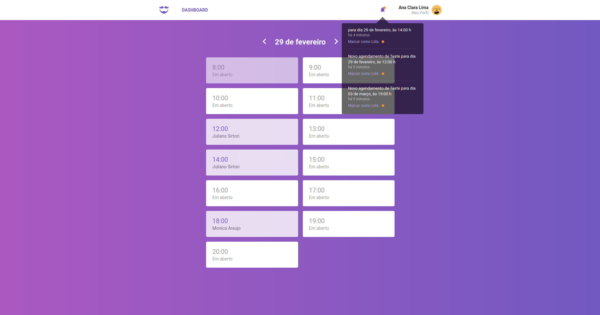

<h1 align="center"></h1>

### :page_with_curl: About
Sistema para agendamentos de salões de beleza.

### :rocket: Repositórios
O sistema é dividido em:

* Api que provem todos os dados, tecnologias: express, nodejs, redis, mongodb. <a href="https://github.com/julianosirtori/GoBarber-BackEnd">Clique aqui para acessar o repositório da API.</a>

* FrontEnd onde o salão poderá consultar os agendamentos, tecnologias: reactjs, redux, redux-saga, styled-components. <a href="https://github.com/julianosirtori/GoBarber-FrontEnd">Clique aqui para acessar o repositório do FrontEnd.</a>

* App, onde os clientes poderão escolher o salão e realizar a sua reserva, tecnologias: react-native, redux, redux-saga, redux-persist. <a href="https://github.com/julianosirtori/GoBarber-Mobile">Clique aqui para acessar o repositório do App.</a>

### :heavy_check_mark: Frontend

  

### :heavy_check_mark: App

  

---

Made with ♥ by <a href="https://www.linkedin.com/in/juliano-sirtori">Juliano</a>

